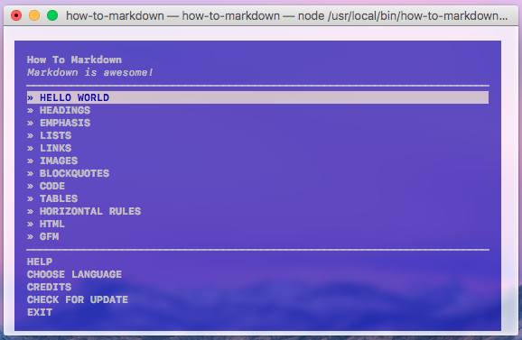

# 💛 HOW TO MARKDOWN 😎

## Requirements

If you are on Windows, make sure you are using at least version 5.1.0 of Node.js, which provides a fix for a bug in Windows where you can't choose items in the menu.

* [**Node.js**](node-url) >=4.0.0 (>=5.1.0 for Windows)

## Installation

Open your terminal and run this command:

    npm install -g how-to-markdown

Use `sudo` if you get an `EACCESS` error.

## Usage

Open your terminal and run the following command:

    how-to-markdown
